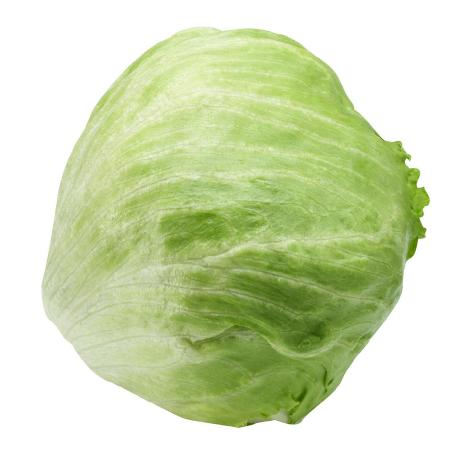

# Awaazo  [](https://github.com/awaazo/awaazo/actions/workflows/build-services.yml)


The goal of project Awaazo is to provide enthusiasts with tools that might not be available in other podcasting apps, helping them navigate and get answers about the podcasts they're listening to, straight to the point using our AI assistant, Wazzo. It's also designed to assist students in generating podcasts on the fly using their lecture notes or other study materials, enabling them to listen to their lectures on the go. On Awaazo, users can share episodes generated or recorded with friends and classmates, fostering discussions about the content and building a community. Users can also take notes at specific timestamps of any podcast, allowing them to return and reflect on what they discovered or found interesting. Additionally, we have an algorithm that recommends the best episodes and podcasts for you, tailored to your interests and listening habits.

<br>

## The Origin of AWAAZO

A voice from the East meets a melody from the West. Drawing inspiration from Urdu's word for "sound" – "آواز", and the French term for "bird" – "oiseau", our name embodies the global allure of narratives. Venture into a dynamic podcasting realm where your stories come alive, amplified by the power of AI.

<br>
## What Sets Awaazo Apart

- **AI-Enhanced Podcast Creation**: Don't just listen—create. With our cutting-edge AI, turn scripts into captivating podcast episodes, complete with voice cloning for an authentic feel.
  
- **Interactive AI Assistant**: Dive deeper into episodes with an AI assistant that knows every episode inside out, ready to guide, inform, and enhance your experience.
  
- **Tailored Discoveries**: Our algorithms fine-tune recommendations based on your tastes, ensuring you're always connected with content you'll cherish.

- **A Community Platform**: Engage, comment, and connect. Awaazo isn't just a platform; it's a community of podcast enthusiasts ready to share and discuss.

- **Rich Content Annotations**: As a creator, add layers to your episodes with timestamps, external links, and insights, offering listeners a comprehensive experience.


<br>

## Core Features

###### **For Listeners**:
- **Explore Feed**: Receive personalized daily podcast recommendations tailored to your interests.
- **Followed Feed**: Keep up with the latest releases from your subscribed creators.
- **AI Assistant**: An intelligent companion familiar with every episode's content, ready to enhance your listening experience.
- **Live Transcripts**: Access real-time transcriptions of episodes for a synchronized reading experience.
- **Personalized Bookmarks**: Highlight and annotate specific moments, allowing you to easily revisit and reflect.

###### **For Creators**:
- **Script-to-Podcast**:
  - **Text-to-Voice**: Transform scripts into captivating audio with advanced text-to-speech AI.
  - **Voice Cloning**: Opt from a range of voices or replicate specific tones for authenticity.
  - **Character Voices**: Assign varied voices to characters, creating a dynamic listening experience.
  
- **Content Annotations**: Provide listeners with added context, external links, and insights at specific timestamps, enriching their experience.

###### **Community Engagement**:
- **Interactive Comments**: Engage in meaningful discussions with fellow listeners and creators.
- **Community Feeds**: Explore shared bookmarks, trending discussions, and collective insights from the Awaazo community.

<br>

## Tech Stack

Awaazo's architecture is crafted with Next.js for the frontend, ensuring fast rendering and SEO benefits. Our backend is built on ASP.NET Core and Python, enabling robust AI integration via LangChain. We harness the power of OpenAI and Eleven Labs APIs for advanced functionalities. Data is managed with the reliable MSSQL and the innovative Pinecone vector database. Deployment is streamlined using Docker containers.

For complete details, refer to our [Tech Stack Wiki](https://github.com/awaazo/awaazo/wiki/Tech-Stack).


<br>


## Setup Instructions to run Awaazo

The following steps show how to run Awaazo on your local machine using Docker.

### Prerequisites:

#### <h2>Docker </h2>

Awaazo runs on Docker, which means that it must be installed on your local machine. 
The following links can be used to download Docker:
- [Download for Windows](https://desktop.docker.com/win/main/amd64/Docker%20Desktop%20Installer.exe?utm_source=docker&amp;utm_medium=webreferral&amp;utm_campaign=dd-smartbutton&amp;utm_location=module)
- [Download for Linux](https://docs.docker.com/desktop/linux/install/)
- [Mac - Intel Chip](https://desktop.docker.com/mac/main/amd64/Docker.dmg?utm_source=docker&amp;utm_medium=webreferral&amp;utm_campaign=dd-smartbutton&amp;utm_location=module&amp;_gl=1*1gb7bzl*_ga*MTg5NDc4NDMyLjE2ODQ1MTc4OTE.*_ga_XJWPQMJYHQ*MTcwNTMzMzA4Ni40Ni4xLjE3MDUzMzMwOTYuNTAuMC4w)
- [Mac - Apple Chip](https://desktop.docker.com/mac/main/arm64/Docker.dmg?utm_source=docker&amp;utm_medium=webreferral&amp;utm_campaign=dd-smartbutton&amp;utm_location=module)

#### <h2>Nvidia CUDA enabled GPU</h2>

Awaazo extensively employs AI and machine learning models, leveraging GPU resources to significantly enhance computation speed. While a CUDA-enabled GPU is not mandatory, its use is <b>highly recommended</b> to achieve superior performance and faster processing speeds.

- [Download CUDA Toolkit](https://developer.nvidia.com/cuda-downloads?)

### Installation:

The installation process pulls the latest Docker images from Awaazo's main branch. Make sure that Docker is running before doing the next steps.

#### Windows
- Download the [docker-compose file for GPU support](https://github.com/awaazo/awaazo/blob/main/docker-compose.latest.yml) or for [CPU-only support](https://github.com/awaazo/awaazo/blob/main/docker-compose.latest-cpu-only.yml).
- Open a terminal and set the current working directory to where the docker-compose file is located.
- Run the following command to start Awaazo: ```docker-compose -f docker-compose.latest.yml up```
- To close Awaazo, run the following command: ```docker-compose -f docker-compose.latest.yml down```

#### Linux
- Download the [docker-compose file for GPU support](https://github.com/awaazo/awaazo/blob/main/docker-compose.latest.yml) or for [CPU-only support](https://github.com/awaazo/awaazo/blob/main/docker-compose.latest-cpu-only.yml).
- Open a terminal and set the current working directory to where the docker-compose file is located.
- Run the following command to start Awaazo: ```sudo docker-compose -f docker-compose.latest.yml up```
- To close Awaazo, run the following command: ```sudo docker-compose -f docker-compose.latest.yml down```

#### Mac

- Download the [docker-compose file](https://github.com/awaazo/awaazo/blob/main/docker-compose.macos-latest.yml).
- Open a terminal and set the current working directory to where the docker-compose file is located.
- Run the following command to start Awaazo: ```sudo docker-compose -f docker-compose.latest.yml up```
- To close Awaazo, run the following command: ```sudo docker-compose -f docker-compose.latest.yml down```


<br>

## Team Members


<table align="center" > 
  <tr>
    <td align="center" valign="top">
      <a href="https://github.com/jonathan-githubofficial">
        
        <br />
        <sub><b>Jonathan Haddad</b></sub>
      </a>
      <br />
      <sub>jonathan200023@gmail.com</sub>
      <br />
      <sub>40111053</sub>
    </td>
    <td align="center" valign="top">
      <a href="https://github.com/usamasaleem1">
        
        <br />
        <sub><b>Usama Saleem</b></sub>
      </a>
      <br />
      <sub>usama.saleem [at] hotmail dot com</sub>
      <br />
      <sub> 40110036</sub>
    </td>
    <td align="center" valign="top">
      <a href="https://github.com/sfranchetto">
        
        <br />
        <sub><b>Steven Franchetto</b></sub>
      </a>
      <br />
      <sub> steven.franchetto@gmail.com</sub>
      <br />
      <sub>40112243</sub>
    </td>
      <td align="center" valign="top">
    <a href="https://github.com/BigSaladMan">
      
      <br />
      <sub><b>Jonathan Pauze</b></sub>
    </a>
    <br />
    <sub>jonathanpauze25@gmail.com</sub>
    <br />
    <sub>40177730</sub>
  </td>
     <td align="center" valign="top">
    <a href="https://github.com/Ahed752">
      
      <br />
      <sub><b>Ahed Memas</b></sub>
    </a>
    <br />
    <sub>ahed.mimas@gmail.com</sub>
    <br />
    <sub>40112710</sub>
  </td>
  </tr>


<tr>
      <td align="center" valign="top">
    <a href="https://github.com/shadijiha">
      
      <br />
      <sub><b>Shadi Jiha</b></sub>
    </a>
    <br />
    <sub>shadijiha@gmail.com</sub>
    <br />
    <sub>40131284</sub>
  </td>
  <td align="center" valign="top">
    <a href="https://github.com/soni2261">
      
      <br />
      <sub><b>Sonia Rahal</b></sub>
    </a>
    <br />
    <sub>soniarahal20@gmail.com</sub>
    <br />
    <sub>40211893</sub>
  </td>
  <td align="center" valign="top">
    <a href="https://github.com/mathieutrudeau">
      
      <br />
      <sub><b>Mathieu Trudeau</b></sub>
    </a>
    <br />
    <sub>mathieutrudeau11@gmail.com</sub>
    <br />
    <sub>40177075</sub>
  </td>
  <td align="center" valign="top">
    <a href="https://github.com/mubashir494">
      
      <br />
      <sub><b>Muhammad Mubashir</b></sub>
    </a>
    <br />
    <sub>mubashirqbl@gmail.com</sub>
    <br />
    <sub>40152977</sub>
  </td>
    <td align="center" valign="top">
    <a href="https://github.com/Radwanbaba13">
      
      <br />
      <sub><b>Radwan Baba</b></sub>
    </a>
    <br />
    <sub>radwangbaba@gmail.com</sub>
    <br />
    <sub>40167316</sub>
  </td>
</tr>
</table>

<br>

---
<sup>This project is licensed under the MIT License - see the [LICENSE](LICENSE) file for details.</sup>  
<sup>© 2023 Awaazo. All Rights Reserved. Licensed under the MIT License.</sup>

